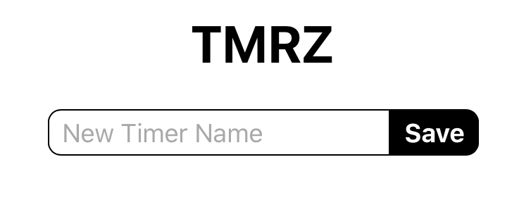
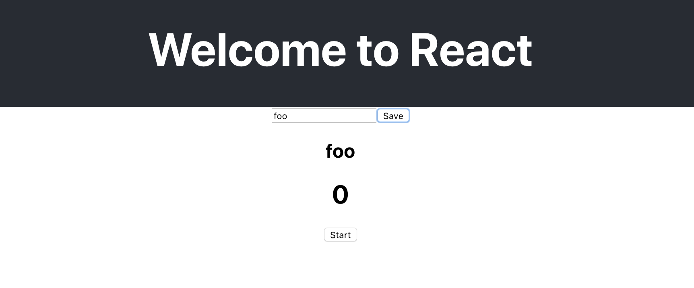

## Technical Planning

1. ~~Build a Timer object~~
1. ~~Define the Actions of a Timer~~
1. ~~Define the Reducers of a Timer~~
1. ~~Allow users to create a Timer~~
1. **Allow users to see a list of Timers**
    1. Create a `list-timers` component that will house a list of timers
    1. Create a `timer-view` component to describe what a timer looks like
    1. Within the `timer-view`, allow for display of a name, time, and start/stop button
    1. Start/stop button should change text when clicked for now
    1. Display your progress so far in the browser
1. Users should be able to start/stop the clock on their Timers
1. Style the app
1. Allow Timers to persist

The list of timers will display all of the timers you have created. Each timer displayed in the list will need to display the following:

- Name
- Time
- Start/Stop - A button to start or stop that timer.

The Timer list itself should display the following:

- A list of timers in the store.

# List-Timers - Boilerplate

> [action]
>
> Create a new file `src/ListTimers.js` with the following boilerplate code:
>
```js
import React from 'react'
import { useSelector } from 'react-redux'
import { selectTimer } from '../actions'
>
export default function ListTimers() {
>	
	return (
		<div>
			{/* render timers here */}
		</div>
	)
}
```

While this implementation doesn't render the timers (yet), it does set up the basic elements required for container/component to interface with Redux!

# The Timer list

To render the list of timers you need to get the timers array from the store. To do this use: `useSelector()`. Pass this method a function that receives state and returns the piece of state you need. 

Add the code below. This should get the `timers` piece of your state, and then map it to a JSX block that will be displayed by the component. 

```js
export default function ListTimers() {
	const timers = useSelector(state => state.timers)

	return (
		<div>
			{timers.map((timer, i) => {
				// Here the render method maps `this.props.timers` to:
				return (
					<div>
						<h2>{timer.name}</h2>
						<h1>{timer.time}</h1>
						<button>Start</button>
					</div>
				)
			})}
		</div>
	)
}
```

The timer list could be implemented as a single component. This simple approach works but doesn't use React's Component architecture to your advantage.

A better approach is to make a component from the block inside map: 

```js
<div>
  <h2>{timer.name}</h2>
  <h1>{timer.time}</h1>
  <button>Start</button>
</div>
```


> [solution]
>
> To make it completely functional you will have to
add styles, possibly some more markup, the time will need to be formatted, and the button will require some logic and a click handler. What does this scream to us?
>
> **BLOAT!!**
>
> With these required additions this component would become far less manageable. In addition there would be a lot of logic, for things like formatting time, that is not core goal of this component, which is displaying a list of timers.

It's always important to break components down into smaller, more easily manageable parts as opposed to inflating them unnecessarily.

# Timer View Component

A better approach is to create a component that is responsible for displaying a single timer. Let's build this out first before we finish up the Timer List.

> [action]
>
> Create a file: `src/TimerView.js` with the following code:
>
```js
import React, {  } from 'react'
import { useDispatch } from 'react-redux'
// Import our toggleTimer action
import { toggleTimer } from '../actions'
>
export default function TimerView(props) {
  // Extract these specific props to use in the component
  const { index, timer } = props
  const dispatch = useDispatch()
>
  return (
    <div>
      <h2>{timer.name}</h2>
      <h1>{timer.time}</h1>
      <button
        onClick={() => dispatch(toggleTimer(index))}
      >
        {timer.isRunning ? "Stop" : "Start"}
      </button>
    </div>
  )
}
```

Notice: `TimerView` takes a `Timer` object as a prop: `timer={timer}`. The name and time properties could then be accessed as: `props.timer.name` and `props.timer.time` within `TimerView`. However, we'll introduce a shorthand to more easily access these properties so we don't need a long string every time.

From here, the render method in `src/components/ListTimers.js` can be simplified!

> [action]
>
> Update the imports and fill in the `render` method for `src/components/ListTimers.js` with the following:
>
```js
import TimerView from './TimerView'
...
export default function ListTimers() {
	const timers = useSelector(state => state.timers)
>
	return (
		<div>
			{timers.map((timer, i) => {
				// Here the render method maps `this.props.timers` to:
				return (
					<TimerView 
						key={`timer-${i}`} 
						timer={timer} 
						index={i} 
					/>
				)
			})}
		</div>
	)
}
```

# Putting it All Together

At this stage, we can now create timers and have them appear, as well as press a start/stop button. Let's update `App.js` to actually show our timers so we have something to look at!

> [action]
>
> Update `App.js` to import our `NewTimer` and `ListTimers` components and then put them in the `Provider`
>
```js
import React from 'react';
import './App.css';
import { createStore } from 'redux';
import { Provider } from 'react-redux';
import reducers from './reducers';
// import new components
import NewTimer from './components/NewTimer'
import ListTimers from './components/ListTimers'
>
const store = createStore(reducers);
>
function App() {
  return (
    <Provider store={store}>
      <h1>TMRZ</h1>
      {/* Display the new components */}
      <NewTimer />
      <ListTimers />
    </Provider>
  );
}
>
export default App;
```

Currently the app is working but needs some styles. 

A common pattern for styling react Components is to create a stylesheet for each component and import those styles into each component. 

This method has it's pros and cons. 

Pros: It makes the components portable. You can copy the styles .css file along with the component .js file together and move them into a new project. 

Cons: Using a .css for each component you will have lots of css styles floating around making it easy to have duplicate class names or other selectors. 

You will use this strategy for this project. To address the concerns above you'll assign the root element of each component a css class name that matches the component name. 

### App Styles 

Open App.css and delete all of the styles. Add these styles: 

```CSS
.App {
  display: flex;
  flex-direction: column;
  align-items: center;
}
```

Open App.js and import thise style sheet by adding this to the top of the page:

```JS
import './App.css';
```

Next add a root element that will get the css class name: `App`

```JS
<Provider store={store}>
  <div className="App">
    <h1>TMRZ</h1>
    ...
  </div>
</Provider>
```

With this in place the style should arrange all the children of `div.App` in a column centered in the page. 


### NewTimer Styles

The NewTimer component has container with two children. Give the container element a class name that matches the component name: 

```JS
export default function NewTimer() {
	...
	return (
		<div className="NewTimer">
			...
		</div>
	)
}
```

Make a new file: `NewTimer.css`

```CSS
.NewTimer {
	display: flex;
	justify-content: center;
}

.NewTimer > input {
	font-size: 1rem;
	padding: 0.25rem 0.5rem;
	border-radius: 0.5rem 0 0 0.5rem;
	border: 1px solid;
	margin: 0;
}

.NewTimer > button {
	font-size: 1rem;
	padding: 0.25rem 0.5rem;
	border-radius: 0 0.5rem 0.5rem 0;
	border: 1px solid #000;
	margin: 0;
	background-color: #000;
	color: #fff;
	font-weight: bold;
}
```

Notice we used the child selector (>) here. This keeps these styles scoped to the parent class name on the parent element. 

Import the styles at the top of `NewTimer.js`

```JS
import './NewTimer.css'
```

### TimerView Styles 

The TimerView component has a three child elements: Name, Time, and Start/Stop button. Let's arrange these in a row with the time in the center and the other elements at either end of the row. 

Open `TimerView.js` and add a class name on the root element. 

```js
export default function TimerView(props) {
  ...
  return (
    <div className="TimerView">
      ...
    </div>
  )
}
```

Make a new CSS file: `TimerView.css`

```CSS
.TimerView {
	width: 320px;
	display: flex;
	flex-direction: row;
	justify-content: space-between;
	align-items: baseline;
}

.TimerView > h1 {
	flex:1;
	margin: 1rem;
	text-align: left;
	font-variant-numeric: tabular-nums;
}

.TimerView > h2 {
	flex: 1;
}

.TimerView > button {
	padding: 0.25rem 0.5rem;
	border-radius: 0.5rem;
	border: 1px solid #000;
	background-color: #000;
	color: #fff;
	font-size: 1rem;
	font-weight: bold;
	width: 4rem;
}
```

Here you styled each of the three children: h1, h2, and button of the parent `div.TimerView`. 

Import your style sheet at the top of `TimerView.js`

```JS
import './TimerView.css'
```

# Product So far

Now go to your browser, and you should see something like the following when you load the page. It's not pretty (we'll fix that later) but Make sure you can create a timer and that it looks like the below screenshots:

**Home Screen (tiny new timer button at the bottom)**


**Creating a new timer named "foo"**


Currently our timers won't start when we press them, but the start/stop button should still change text when you press it

> [action]
>
> Make sure your star/stop button changes text when you press it. If it doesn't go back through this chapter and make sure everything matches up. Now is a great time to practice your debugging skills!

Whew, that was a lot, but we've now **built another two React components with JSX syntax,** and also got to see **data/state be passed using the Flux pattern!** Now if only our timers actually...timed anything! We'll fix that in the next chapter but first...

# Now Commit

>[action]
>
```bash
$ git add .
$ git commit -m 'added list of timers'
$ git push
```

# Stretch Challenge

> [challenge]
>
> What if we want to delete a timer? Add functionality so that we can delete a timer from the list.
