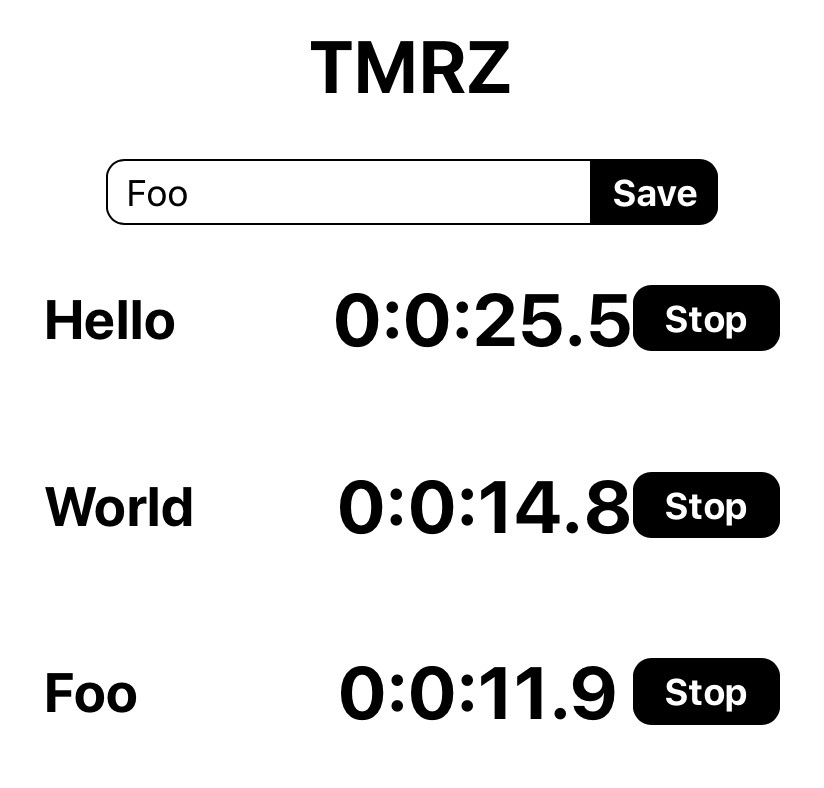

So we have everything displaying, but the timers still aren't running. It's about time we fixed that and actually gave the start/stop buttons something to do!

## Technical Planning

1. ~~Build a Timer object~~
1. ~~Define the Actions of a Timer~~
1. ~~Define the Reducers of a Timer~~
1. ~~Allow users to create a Timer~~
1. ~~Allow users to see a list of Timers~~
1. **Users should be able to start/stop the clock on their Timers**
    1. Learn how to properly track the delta time for each timer
    1. Create an Update action that updates the time for a given timer
    1. Insure your reducer knows how to properly handle your update action
    1. Tell the store to run Update so that the view can display the accurate time
1. Style the app
1. Allow Timers to persist

# Update Action

Currently we have all these actions associated with timers, but nothing that tells them how to update the time on the views. We need to build out an update action so that the timers can make sure to regularly update their time. This action Object only needs a type, and the payload should be the number of milliseconds since the last update.

> [action]
>
> In `/src/actions/index.js`, add the following UPDATE action, and action creator:
>
```js
...
export const UPDATE = "UPDATE"
>
export const update = (deltaTime) => {
  return {
    type: UPDATE,
    payload: { deltaTime }
  }
}
>
...
```

# Quick Aside on Delta Time

Wow hang on, what's `deltaTime`? You're going to be using `deltaTime` to help calculate what time the timer should be displaying.

The CPU is in charge of handling a _lot_ of stuff, so while keeping time sounds simple, it's hard for the CPU to do it accurately given all the other processes it has on its plate.

This means something like the following code won't keep an accurate sense of time:

```JavaScript
var secs = 0
setInterval(() => {
  secs += 1
  console.log(secs)
  // do something every ~second
}, 1000)
```

You can actually see this happen yourself in this [example](https://repl.it/@MitchellHudson/setInterval-delta-time).

> [info]
>
> The `setInterval` method provides a callback that repeats forever
after a designated interval:
> `setInterval(callback, milliseconds)`
>
> If you wanted to just do a one time callback, you would use `setTimeOut`, which takes the same parameters

A better method is to _keep track of the time that has elapsed
in milliseconds by getting the difference in in time between
callbacks from `setInterval`._ This called **delta time.**

The method below gives a very accurate representation
of time:

```JavaScript
var time = 0
var lastUpdate = Date.now()

setInterval(() => {
  var now = Date.now()
  var dt = now - lastUpdate
  time += dt
  lastUpdate = now
  console.log(count, dt, time)
}, 1000)
```

Here time is calculated as such:

1. Getting the current time in ms (`Date.now()`)
1. Finding the difference in time since the last update (`now - lastUpdate`). This is delta time and is the number of milliseconds since the last update.
1. Updating the time by the delta (`time += dt`)
1. Updating `lastUpdated` to be the current time (`lastUpdate = now`)

> [info]
>
> The `Date` object creates a `Date` instance which represents a single moment in time. `Dates` are stored as an integer value equal to the number of seconds since January 1, 1970 (the [Unix Epoch](https://en.wikipedia.org/wiki/Unix_time)).
>
>The Date Object provides a long list of methods that allow you to use for wide range purposes.

# Update Reducer

Armed with this new knowledge on timing, intervals, and dates in JavaScript, let's update our `timers-reducer.js` file to handle our new Update action:

> [action]
>
> Update `src/reducers/timersReducer.js` to handle the new actions 'UPDATE' action.
>
> Import the `UPDATE` at the top:
>
```JS
import { NEW_TIMER, TOGGLE_TIMER, UPDATE } from '../actions';
```
>
> Then add another case to your switch statement:
>
```js
const timerReducer = (state = [], action) => {
  switch (action.type) {
>
    case UPDATE:
      return state.map((timer) => {
        if (timer.isRunning) {
          timer = { ...timer, time: timer.time += action.payload.deltaTime }
        }
        return timer
      })
    ...
  }
}
```

The above creates a new array of timers. For all timers where the `isRunning` property is `true` it makes a new timer Object where `time` is the old `time` plus the `deltaTime` on the payload.

# Update the View

In some cases (such as our current one) we will want to dispatch actions to the store without sending them from a view. To do this, you need to _update the store using a `setInterval` callback._

Within our callback, we should call `store.dispatch(action)`, where `action` is an action object with a type. Following best practices, we should _call an action creator to generate the action Object!_ Good thing we just built that!

> [action]
>
> Update `App.js` to update the timers every 50ms:
>
```js
...
// Import the update action for use
import { update } from './actions'
...
>
const store = createStore(reducers);
>
let lastUpdateTime = Date.now()
setInterval(() => {
  const now = Date.now()
  const deltaTime = now - lastUpdateTime
  lastUpdateTime = now
  store.dispatch(update(deltaTime))
}, 50)
>
...
```

Open your browser and see if the timers update their time when you click Start. Do they stop when you press Stop?

Great work so far, but something is still missing...

# Formatting Time

Timers can be hard for people to read if they're only displaying the time in milliseconds. Let's fix this so that they show in a proper `hour:minute:seconds.milliseconds` format:

> [action]
>
> Create a new folder in `/src` called `/utils`. Create a new file `/src/utils/index.js` and add the following time formatting function:
>
```js
export const formatTime = (time) => {
    const ms = Math.round(time / 100) % 10
    const secs = Math.floor(time / 1000) % 60
    const mins = Math.floor(time / 1000 / 60) % 60
    const hrs = Math.floor(time / 1000 / 1000 / 60) % 60
    return `${hrs}:${mins}:${secs}.${ms}`
}
```
>
> Now use that function in `/src/components/TimerView.js` to display the time correctly. Remember to import the util:
>
> Import `formatTime` at the top:
>
```js
import { formatTime } from '../utils';
```
> Then use `formatTime` to format the time: 
> 
```JS
...
<h1>{formatTime(timer.time)}</h1>
...
```

# Product So Far

Your timers should now look like something like the following:



Alright! We've successfully **used timing methods and objects in JavaScript to accurately track time!** And because of it, our timers now work! This is great! They still look a little ugly though, let's spruce them up a bit.

# Now Commit

>[action]
>
```bash
$ git add .
$ git commit -m 'timers running'
$ git push
```

# Stretch Challenges

> [challenge]
>
> 1. Our `formatTime` function uses a lot of repetitive code. Can you refactor it so that it's written in a way that is more in line with the DRY principle?
> 1. Being able to start/stop a timer is great, but what about being able reset a timer so that we can use it again? Implement a reset button for your timers that resets the time. Reset should stop the timer and then set it back to `00:00:00.0`
